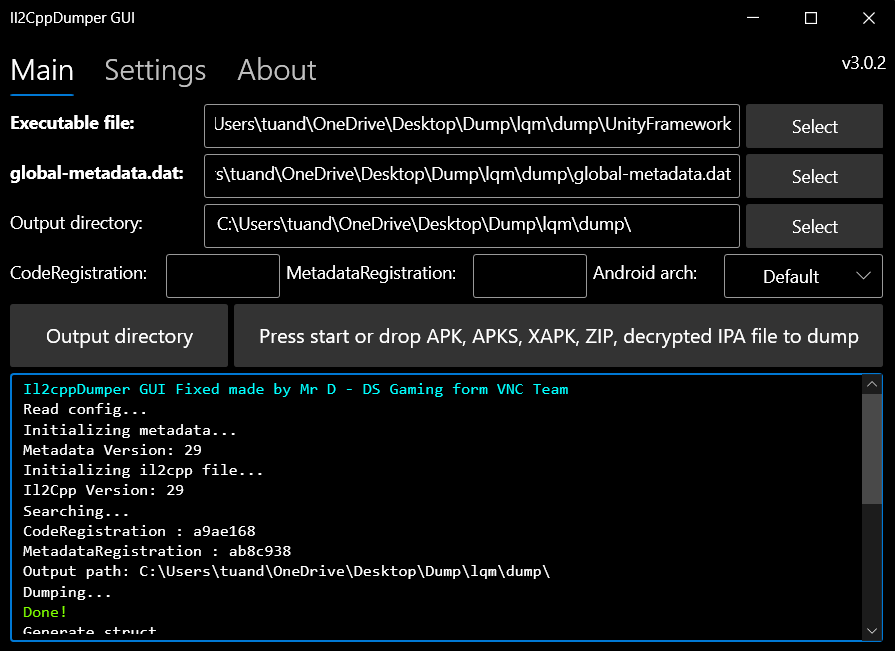

# Il2CppDumper cho Call of Duty Mobile  

  

Đây là **Unity Il2CppDumper GUI** mà tôi phát triển dựa trên mã nguồn gốc của **Perfare**.  
Phiên bản này đã được tối ưu và chỉnh sửa để hoạt động tốt với **Call of Duty Mobile**.  

✅ Chạy trên **Windows**  
✅ Hỗ trợ cả **Android** và **iOS**  
✅ Giao diện GUI trực quan, dễ sử dụng  
✅ Có thể tạo **struct**, **dummy dll**, và xuất ra script cho IDA/Ghidra/Hopper   

---

## 🚀 Cách sử dụng  

1. Chuẩn bị file:  
   - `libil2cpp.so` (Android) hoặc `file Executable chính của game` (iOS)  
   - `global-metadata.dat`  

2. Chạy `Il2CppDumper GUI`  

3. Chọn:  
   - **Executable file** → trỏ tới `libil2cpp.so` hoặc `file Executable chính của game`  
   - **global-metadata.dat** → trỏ tới metadata của game  
   - **Output directory** → chọn thư mục để lưu kết quả  

4. Nhấn **Start** → tool sẽ tự động:  
   - Dump dữ liệu  
   - Sinh struct  
   - Sinh dummy dll  
   - Copy script hỗ trợ phân tích vào thư mục output  

5. Mở file `dump.cs` hoặc dummy dll bằng **dnSpy/ILSpy** để phân tích.  

---

## 🙏 Credits  

- **[Perfare](https://github.com/Perfare)** – Tác giả gốc của Il2CppDumper  
- **[AndnixSH](https://github.com/AndnixSH)** – Tác giả GUI phiên bản trước  
- **[tien0246](https://github.com/tien0246)** – Nâng cấp Il2CppDumper (bản dành riêng CODM)  
- **Mr D - DS Gaming (VNC Team)** – Phát triển bản tùy biến GUI hỗ trợ CODM (Android/iOS)  